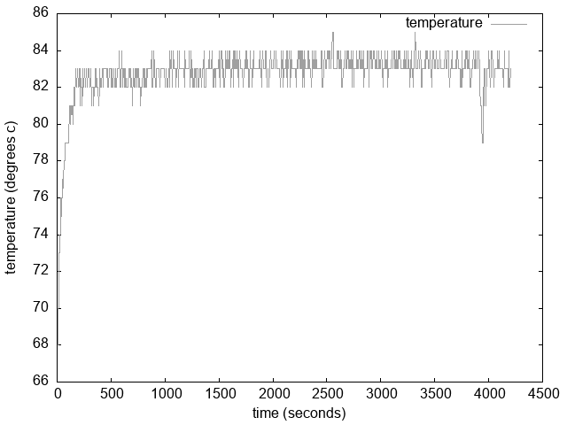
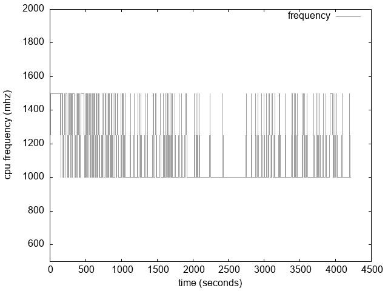
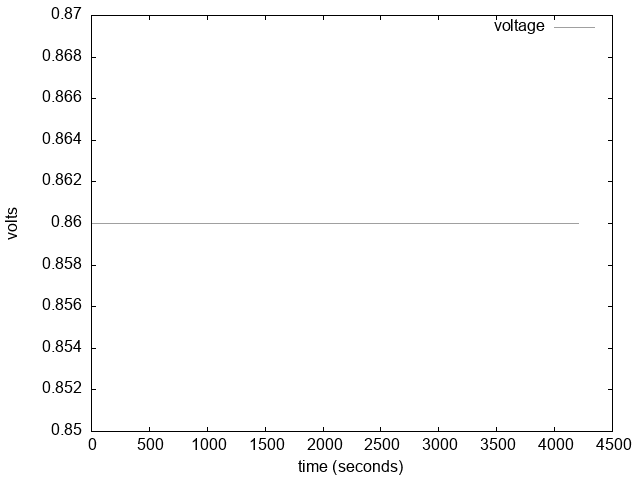
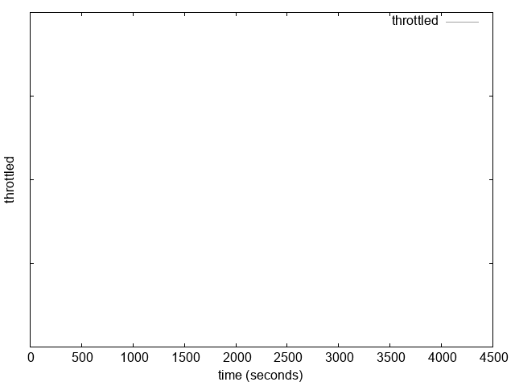
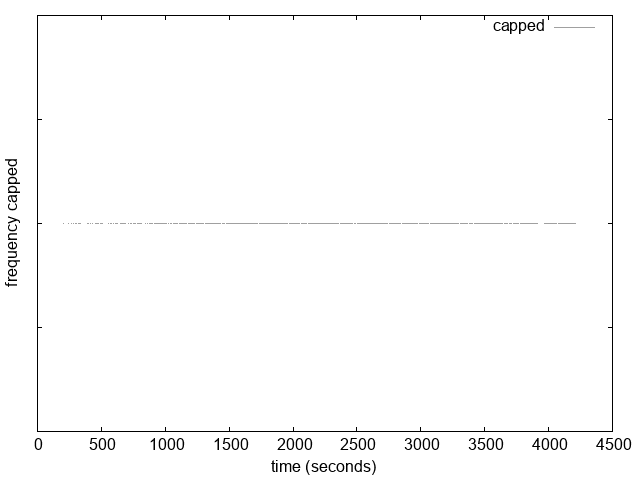

# Report

Brief overview of the graphs generated from performance monitoring script.

## System Temperature

As shown in the temperature graph, once the kernel build started the system temperature rose rapidly. The temperature remained elevated for the duration of the build process. This is to be expected as the CPU moves from idle to constant work. The temperature remained below 90 degrees, so the CPU was able to handle the load easily and should not have throttled.

## CPU Frequency

The CPU in the system is able to dynamically scale its frequency. The above frequency graph shows that the system was consistently scaling frequency up and down. The periods of higher frequency allowed the system to better handle the heavier requirements of the kernel build.

## Voltage

As evident from the graph, there does not seem to be any voltage fluctuations throughout the kernel build. The voltage returned from measure_volts stays constant at 0.86.  

## Throttled

The graph shows no throttling event during the kernel build. From this, we can assume that the Pi can handle kernel builds easily without throttling the CPU.

## Capped Frequency

Similar to the throttling graph. The capped frequency graph does not show any signs of capped CPU frequency during the kernel build. This further solidifies our assumption that the Pi 4 with 4 GB RAM can easily handle kernel builds.
